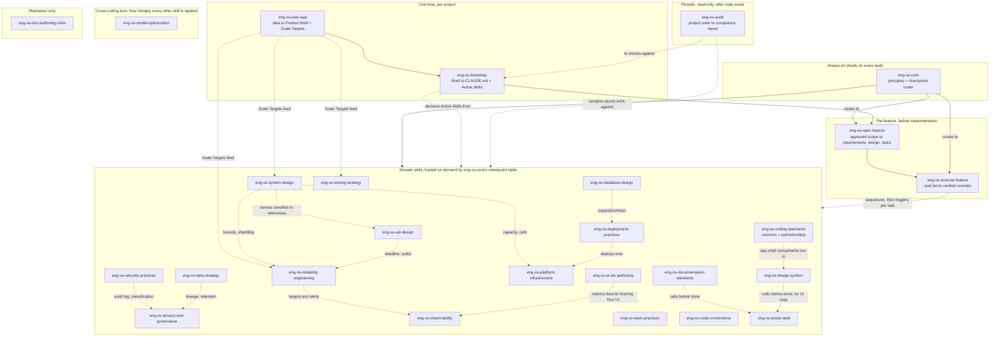

# Engineering OS Skills: Mind Map

**Status:** Current
**Owner:** Haresh V. Parekh
**Audience:** anyone deciding which skills to load, extend, or export. Start here, not in the 28 individual SKILL.md files.

This is the map of how the 28 skills relate to each other and where each one earns its keep. Read it before any individual skill: it says what exists and why, so nobody has to discover it by grepping 28 files.

---

## 1. The shape of the whole system

**Read order for a new project:** `eng-os-plan-app` (including Phase 2b Scale Targets) → `eng-os-bootstrap` → (`eng-os-core` loads and stays on) → `eng-os-spec-feature` for each feature or Product Brief phase that meets its spec threshold → `eng-os-execute-feature` to run its task list (directly, with no spec, for a small change) → whichever domain skills the task list names. Periodically, or before a release: `eng-os-audit`.

**Scaffold checklists** for a new service or pipeline live in `eng-os-system-design/references/service-checklist.md` and `eng-os-data-strategy/references/pipeline-checklist.md`.

---

## 2. Value map: what each skill buys the consumer

Ranked by how much rewrite-avoidance and drift-prevention it buys, based on the failure evidence in `../evidence/ledger.md`.

### Tier 1: prevents the expensive mistakes

| Skill | What it stops | Evidence |
|---|---|---|
| `eng-os-plan-app` | Building before requirements, entities, screens, terminology, and scale targets are locked | 4 apps hand-wrote the same brief shape; one renamed a core concept 3 times mid-build; systems sized by guesswork found their bottleneck at launch (ledger E-01, E-02, E-17) |
| `eng-os-core` | Standards silently skipped because "early reads decay" over a long session | The OS's own documented failure mode before the skills conversion (E-03) |
| `eng-os-bootstrap` | False structure on trivial scripts; skipped structure on real apps; a template populated with prose too thin to bind anything | 2 of 6 apps had no CLAUDE.md; 1 was a single script; the Architecture Practices Gate exists because a general "populate" pass let practices drift (E-04, E-05, E-15) |
| `eng-os-execute-feature` | A whole feature built in one unverified pass | Structural gap found comparing the OS against BMAD, Spec Kit, OpenSpec, Kiro, GSD (E-06) |
| `eng-os-code-conventions` (Terminology Lock) | Mid-project renames touching the whole codebase | Campaigns→Events→(again), Evaluate→Analyze, Documentation→Platform Guide in one app's changelog (E-02) |
| `eng-os-reliability-engineering` | A dependency blip becoming an outage: no timeouts, stacked retries, unbounded queues, no degraded path | Retry storms and a non-critical sidebar taking a critical page down are the two most common self-inflicted outages at scale (E-18) |

### Tier 2: prevents silent drift across a multi-app suite or a growing platform

| Skill | What it stops | Evidence |
|---|---|---|
| `eng-os-spec-feature` | Behavior left undefined until it surfaces as rework; a task list with nothing agreed to check it against | Structural gap found in the same framework comparison as E-06; no downstream incident recorded yet (E-29) |
| `eng-os-design-system` | Hand-retyped tokens drifting between sibling apps; header/footer duplicated per page; layouts untested off desktop; screens no keyboard user can operate | 4+ apps retyped identical tokens by hand (E-07); accessibility retrofits cost more than building it in (E-19) |
| `eng-os-coding-standards-common` Standard 13 (MVC) | Business logic inline in route handlers | Repeated drift from MVC in new projects despite Separation of Concerns (E-08) |
| `eng-os-security-practices` + `eng-os-privacy-and-governance` | Authenticated-but-not-authorized endpoints; personal data in logs; deletion that leaves copies | Cross-tenant leaks are the top high-severity bug class in multi-tenant APIs (E-20) |
| `eng-os-database-design` | Random UUID keys fragmenting indexes; locking migrations; missing tenant predicates | Standard at-volume failure modes (E-21); compound classification enums that exploded combinatorially (E-14) |
| `eng-os-observability` + `eng-os-ai-ids-authoring` | AI results with no visible provenance; unbounded metric labels | Convergent pattern across every AI-IDS app (E-09); a single high-cardinality label taking down a shared metrics backend (E-22) |
| `eng-os-data-strategy` | Stale data rendered as fresh; late data silently miscounted | Online/offline fusion score with no staleness indicator (E-10) |
| `eng-os-prose-style` | Docs and UI copy that read as unedited AI output | Audit of a published documentation site found the patterns on every page (E-11) |

### Tier 3: standard implementation discipline

`eng-os-api-design`, `eng-os-testing-strategy`, `eng-os-deployment-practices`, `eng-os-platform-infrastructure`, `eng-os-coding-standards-*`: the skills that keep code correct day to day. `eng-os-core` routes to them on nearly every turn, so their cost must stay low (short SKILL.md, detail in `references/`). Two `eng-os-coding-standards-common` rules in this tier have their own evidence: the 3-letter, 6-digit message-code prefix (E-12) and extract-on-second-occurrence for shared third-party clients (E-13).

### Tier 4: situational

`eng-os-system-design` (architecture-level, infrequent; carries the service checklist), `eng-os-team-practices` (process, not code), `eng-os-documentation-standards`, `eng-os-doc-authoring-rules` (maintainer-only), `eng-os-audit` (periodic, not per-task).

### Orthogonal: a lens, not a gate

`eng-os-model-optimization` changes how cheaply and quickly every other skill is applied. Its canonical source is `meta/agent-operations.md`.

---

## 3. Known scope limits

Rules that hold with caveats, stated in each skill's own text:

- **Atomic multi-entity saves** (`eng-os-design-system` 3.8, `eng-os-database-design`): only within one database's transaction boundary; across services, saga or outbox.
- **Design System Inheritance by path reference** (`eng-os-design-system`): monorepo or single-team; cross-team production needs a versioned published token package. The same advice applies to this OS: downstream projects pin a release tag.
- **AI-IDS Scoring Run always inline** (`eng-os-ai-ids-authoring/references/observability-ui.md`): sample or drill down at high QPS.
- **Spec Feature** (`eng-os-spec-feature`): applies only above its Phase 0 threshold (three or more tasks, a new contract or entity, edge-case behavior, or ambiguous scope); its evidence is comparative, not incident-based, so Tier 2 until a downstream project records a failure it would have caught.
- **Freshness badges** (`eng-os-data-strategy`): only for fields with a declared SLA.
- **"Every metric is a doorway"** (`eng-os-design-system` 3.8): a Consider note, not a gate.
- **Canonical/Shadow Divergence Tracking** (`eng-os-data-strategy`): not a substitute for MDM.
- **The default design profile** (`eng-os-design-system/references/profile-default.md`): one team's values, adopted or replaced per project; the rule is the declaration, not the pixel numbers.
- **TypeScript casing** (ADR-001, camelCase in code, snake_case at the wire) and **Python docstring style** (ADR-002, Google-style, JSDoc kept for TypeScript) are both decided. Both in `../docs/decisions/`.

---

## 4. Where this map itself might drift

`tools/lint-os.py` checks that the skill count here matches the folders on disk and that every skill named here exists. It does not check that the tiers still reflect the evidence; update the tier tables and the ledger in the same change as any skill add, split, or delete.
